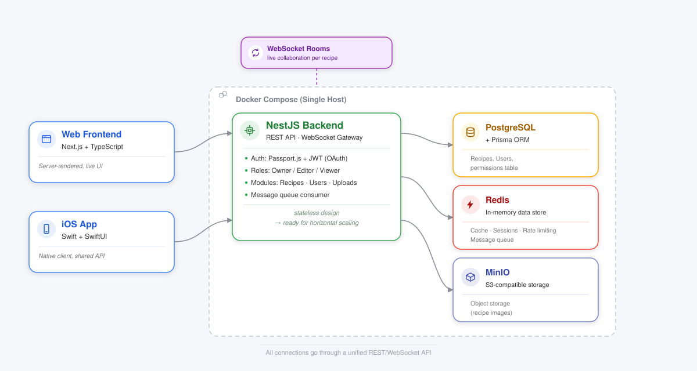

# System Architecture

## Overview

API-first architecture: a central backend exposes a REST API and WebSocket connections that any number of frontends (web and iOS) can connect to. The whole system is containerized and designed to be stateless, so it can be scaled horizontally later without any code changes. Images and other large files are stored in an S3-compatible object storage (MinIO for self-hosting, AWS S3 for cloud hosting).

## Backend

**Framework:** NestJS (Node.js + TypeScript)
Modular structure with controllers and services 

**Database:** PostgreSQL + Prisma (ORM)
Relational structure, granular enough (individual fields/sections per recipe can be updated independently) to support real-time collaboration

**Caching & Message Queue:** Redis
- Caches frequently requested recipes
- Sessions
- Rate limiting
- Message queue for asynchronous background jobs (e.g. AI-powered recipe import)

**Object Storage:** MinIO (S3-compatible)
Stores recipe images via the S3 API; self-hostable, and interchangeable with real AWS S3.

**Authentication:** Passport.js + JWT
- Supports classic login as well as OAuth (Google, GitHub, etc.)
- Optional future addition: Passkeys via SimpleWebAuthn

**Real-time Collaboration:** WebSockets (NestJS Gateways)
When a user opens a recipe, they join a "room"; changes are broadcast live to every other participant in that room.

**Permission System** 

Permissions are checked both on REST requests and when a WebSocket connection is established.

## Deployment & Scaling

**Now – Docker Compose (single host):**
Backend, PostgreSQL, Redis, and MinIO each run as their own container, orchestrated via a single `docker-compose.yml`. 

**Planned expansion – Kubernetes:**
Since the backend is stateless, any number of copies can run in parallel. Kubernetes would take care of:
- Load balancing across backend instances (via a Service)
- External exposure (via an Ingress Controller)
- Automatic scaling based on load

Data consistency for concurrent writes is handled by PostgreSQL itself through transactions and locks.

## Web Frontend

**Framework:** Next.js + TypeScript (subject to change)

**State Management:** TanStack Query (React Query)
Handles caching of API responses in the browser, background refetching, and pairs well with the live WebSocket updates.

## iOS App

**Language/UI:** Native Swift with SwiftUI

**Networking:** Async/await + URLSession (no extra framework needed) to talk to the REST API

**Offline storage:** SwiftData for local access to recipes without an internet connection